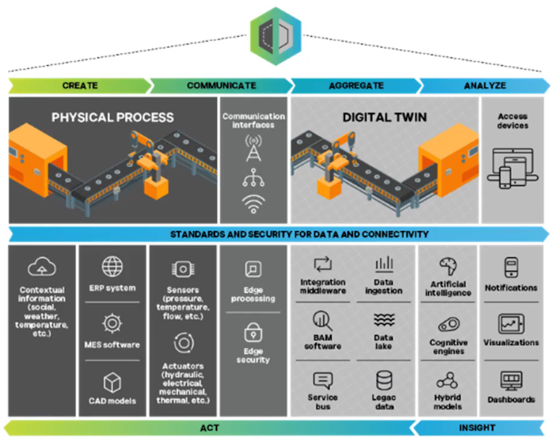

# 디지털 트윈

## 개요
- 실세계의 데이터를 가상세계에 실시간으로 시각화 하는 기술
- CPS와 방식이 다름
- 실제 시스템의 디지털 복제로 온 데이터임

### 역사
- 1991년 데이비드 지런터 저서 미러 월드에서 처음 언급
- 2002년 제조업에 처음 적용

### 방식
- 가상 환경 상의 물리적 자신의 기능, 특성 등을 디지털로 복제하는 방식으로 작동
- 제품에서 데이터를 수집하는 스마트 센서 사용
- IoT, AI(머신러닝) 등 필요

### 개념적 구조

- 생성 - 물리적 공정에서 측정되는 센서 데이터 등
- 전달 - 실시간 양방향 통합과 연결 지원
- 통합 - 데이터 보관소리 이관데이터 처리
- 분석 - 데이터 분석
- 이해 - 분석을 통한 산출물을 시각화
- 실행 - 전 단계에서 실행가능한 피드백 적용

## CPS 개요

### 개념
- Cyber Physical System - 센서, 액추에이터, 통신 인프라등으로 물리적 환경과 정보기술을 결합하는 것
- 컴퓨터의 발전과 시작되었음

## 적용사례

### 항공우주산업
- 항공기 및 우주선 제품 개발 및 프로토타입 제작
- 항공우주 교육분야
- 항공기 우주선과 관련된 장비 유지관리와 운영
- 보잉사의 AR기반의 항공기 검사 앱

### 건축산업
- 패스

### 자동차산업
- 자동차의 3D 디자인 및 제품 개발
- 테슬라의 완전 자율 주행 시뮬레이션 적용

### 제조산업
- 디지털트윈의 중심지
- 롤스로이스의 제트기 엔진 개발에 적용

## 실시간 임베디드 시스템
- 특정작업을 위한 하드웨어와 소프트웨어가 결합된 시스템
- 가전제품, 통신기기 등...
- 하드디스크 등이 필요없음
- 아두이노, 라즈베리파이, NodeMCU, Atmega128 등...
- 특정시간의 제한 내에 기능이 동작되어야 하는 임베디드

### 적용사례
- 자동차
- 스마트 팩토리
- 스마트 홈

### 스케줄링
- 정해진 순서대로 시스템을 사용하는 것이 아닌 동시에 여러일을 수행하는 것
- 1980년대부터 개념 나오기 시작
- 고정 우선순위 실시간 시스템으로 발전
- 비선점 스케줄링과 선점 스케줄링

#### 비선점 스케줄링 
##### FCFS
- 도착한 순서에 따라 프로세스 할당
- 하나의 프로세스가 CPU를 할당한 뒤 끝날때까지 대기
- 작업완료 시간 예측 쉬움
- 콘보이 현상같은 단점

##### SJF
- 대기중 프로세스 중 CPU처리시간에 가장 짧은 프로세스 우선적 할당
- 평균 대기시간이 가장 짧은 방식
- CPU할당을 받지 못하는 긴 프로세스의 기아 현상

##### HRN
- 큐 대기시간까지 고려 프로세스 스케줄링
- 대기 시간이 긴 프로세스에 높은 우선순위 부여

#### 선점 스케줄링
- 다른 프로세스가 끼어들 수 있는 방식

##### 고정우선순위 스케줄링
- 최고 우선순위부터 낮은 우선순위로 할당
- 최고 우선순위에 새로 들어온 일이 있으면 계속 대기

##### 타임슬라이스 스케줄링
- 시간을 공정하게 나누어 일정시간 간격으로 사용
- 무한정 기다리는 기아현상은 없음

## 센서와 기계

### 센서
- 물체의 움직임, 온습도, 소리, 조도 등을 감지하고 측정하는 것
- 사람의 감각기관과 같으 기능 수행

#### 센서 종류
- 가속도 센서
- 자이로 센서
- 레이저 거리 센서
- 가스 센서
- 적외선 거리/가스 센서
- 압력 센서
- 온습도 센서
- 이온 센서
- 조도 센서
- 초음파 거리 센서
- 촉각 센서
- 이미지 센서
- LiDAR

### 로봇
- 이동, 조작, 위치 조절 등의 다양한 작업을 수행하고자 프로그램된 작동 메커니즘으로 일정한 자율성을 갖춘 기계
- 서비스 로봇 - 인간이나 장비를 위해 유용한 작업을 수행하는 개인용 또는 전문용 로봇 
- 의료용 로봇 - 의료 장비나 의료 시스템에 사용되는 로봇
- Manipulator - 로봇 팔. 산업용, 의료용 등
- 산업용 로봇 종류 - HACK...

#### 엔드이펙터
- 로봇이 작업을 수행할 수 있또록 특별히 설계된 장치. 작업 대상에 직접 작용하는 기능을 가진 부분
- Manipulator 끝 인터페이스에 부착
- 그리퍼 - 핑거그리퍼, 진공그리퍼, 소프트그리퍼, 마그네틱그리퍼
- 샌더 - 표면 연마용
- 스크류 드라이버, 용접기

### 로봇 기구학
- 링크, 조인트, 자유도...

- [다음](./UNITY_STUDY.md)