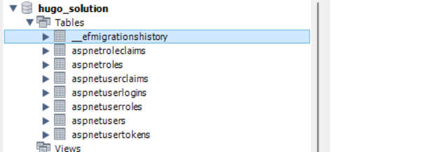
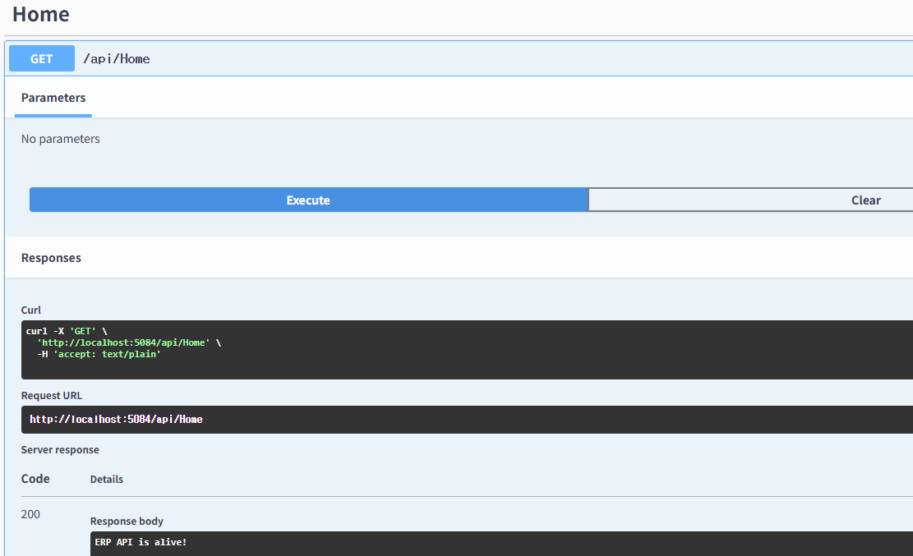

## ERP 솔루션
ERP 

### ASP.NET Core Identity + MySQL + Razor/API
- NuGet 패키지 설치

    ```bash
    dotnet add package Microsoft.AspNetCore.Identity.EntityFrameworkCore
    dotnet add package Pomelo.EntityFrameworkCore.MySql
    dotnet add package Microsoft.AspNetCore.Identity.UI
    dotnet add package Microsoft.EntityFrameworkCore
    dotnet add package Microsoft.EntityFrameworkCore.Tools                  // Add-Migration 명령어.
    dotnet add package Microsoft.VisualStudio.Web.CodeGeneration.Design     // Scaffold-Identity 명령어
    dotnet add package Microsoft.AspNetCore.Identity.UI

    ```
    - Microsoft.EntityFrameworkCore.Tools 가 있어야 NuGet패키지 콘솔에서 명령어 사용가능

- ApplicationUser 사용자 클래스 생성
- ApplicationDbContext 클래스 생성
- appsettings.json에 MySQL 연결 설정 
- Program.cs 구성

- 마이그레이션 및 DB생성

    ```bash
    PM> Add-Migration InitIdentity
    Build started...
    Build succeeded.
    To undo this action, use Remove-Migration.
    PM> Update-Database
    Build started...
    Build succeeded.
    Microsoft.EntityFrameworkCore.Database.Command[20101]
        Executed DbCommand (10ms) [Parameters=[], CommandType='Text', CommandTimeout='30']
        SELECT 1 FROM INFORMATION_SCHEMA.TABLES WHERE TABLE_SCHEMA='hugo_solution' AND TABLE_NAME='__EFMigrationsHistory';
    // 생략
    Done.
    PM> 
    ```

    

- 프로젝트 폴더 콘솔에서 아래의 명령 실행 - Visual Studio에서 ASP.NET Core용 UI Scaffolding 확장 도구

    ```bash
    > dotnet tool install -g dotnet-aspnet-codegenerator
    ```

- CLI에서 아래 명령어 실행

    ```bash
    > dotnet aspnet-codegenerator identity -dc ApplicationDbContext
    Building project ...
    Finding the generator 'identity'...
    Running the generator 'identity'...
    RunTime 00:00:51.60
    ```

    - Areas/Identity/Pages/Account/ 아래 Login.cshtml  부터 여러 파일 생성확인

- Pages/Employees/Index.cshtml 페이지 만들기
    - Index.cshtml, Index.cshtml.cs 파일 작성

- Swagger를 위한 API 컨트롤러 확인
    - Controller/HelloController.cs 
    - Swagger에서 확인됨

    

